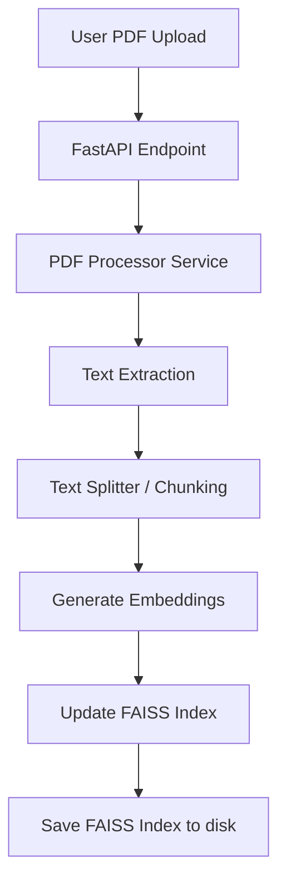
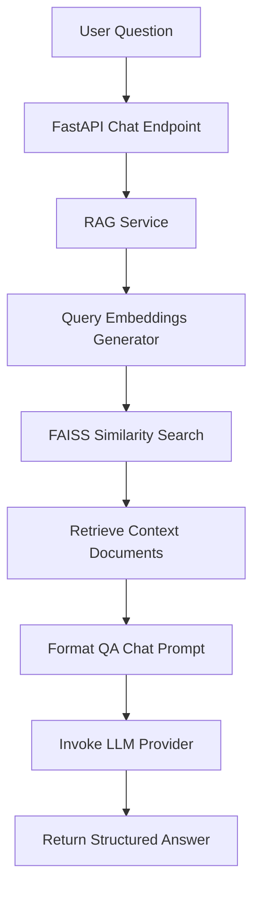

# RAG Chatbot System Architecture

This document describes the flow and architecture of the Retrieval-Augmented Generation (RAG) system.

## Ingestion Pipeline Flow

## Retrieval and QA Flow

## Modular Layers

1. **API Layer (`app/api`)**: Receives requests, handles authentication, returns Pydantic DTO responses.
2. **Services Layer (`app/services`)**: Business logic (parsing documents, configuring LangChain chains, calling APIs).
3. **Vector Store Layer (`app/vectorstore`)**: Database interface wrapper wrapping FAISS index interactions.
4. **Schemas Layer (`app/schemas`)**: Validates input payloads and structures JSON outputs.
5. **Prompts Layer (`app/prompts`)**: Manages model templates.
6. **Core Layer (`app/core`)**: Handles security dependencies and global settings loading.
