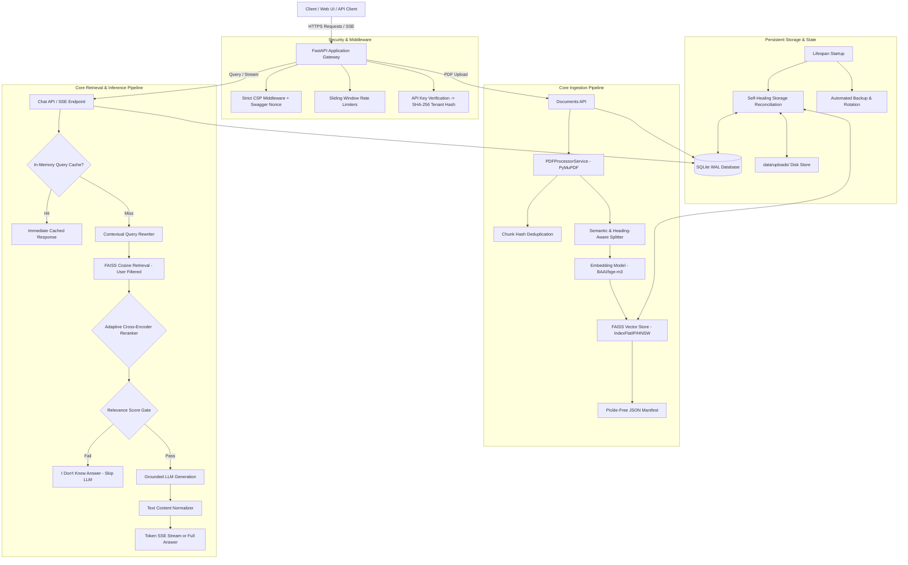
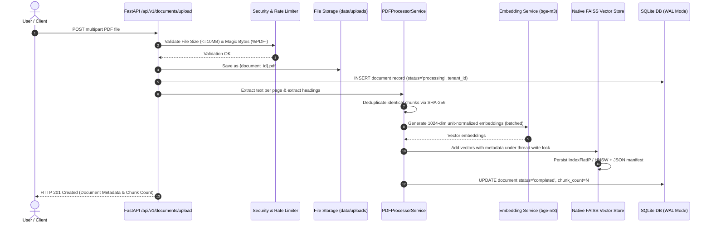
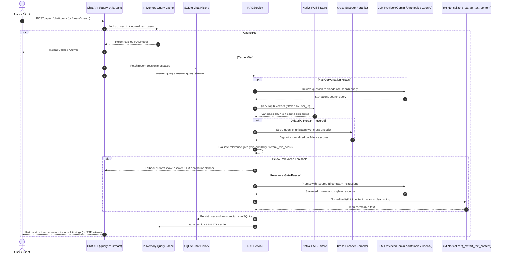
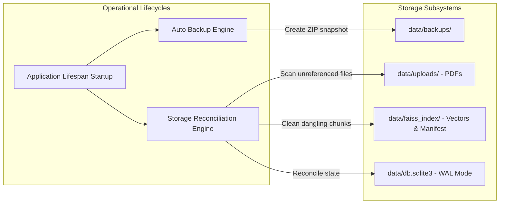

# RAG Chatbot System Architecture

This document describes the high-level system architecture, ingestion pipeline, retrieval/inference pipeline, and cross-cutting infrastructure of the **RAG PDF Chatbot**.

---

## 1. High-Level Architecture Overview

The system is organized into modular layers with strict separation of concerns, multi-tenant isolation, thread safety, and operational self-healing.

```mermaid
graph TD
    Client[Client / Web UI / API Client] -->|HTTPS Requests / SSE| Gateway[FastAPI Application Gateway]
    
    subgraph Security & Middleware
        Gateway --> CSP[Strict CSP Middleware + Swagger Nonce]
        Gateway --> RateLimit[Sliding Window Rate Limiters]
        Gateway --> Auth[API Key Verification -> SHA-256 Tenant Hash]
    end

    subgraph Core Ingestion Pipeline
        Gateway -->|PDF Upload| DocEndpoint[Documents API]
        DocEndpoint --> PDFProc[PDFProcessorService - PyMuPDF]
        PDFProc --> ChunkDedup[Chunk Hash Deduplication]
        PDFProc --> ChunkSplit[Semantic & Heading-Aware Splitter]
        ChunkSplit --> EmbedModel[Embedding Model - BAAI/bge-m3]
        EmbedModel --> VectorStore[FAISS Vector Store - IndexFlatIP/HNSW]
        VectorStore --> Manifest[Pickle-Free JSON Manifest]
    end

    subgraph Core Retrieval & Inference Pipeline
        Gateway -->|Query / Stream| ChatEndpoint[Chat API / SSE Endpoint]
        ChatEndpoint --> QueryCache{In-Memory Query Cache?}
        QueryCache -->|Hit| FastResponse[Immediate Cached Response]
        QueryCache -->|Miss| Rewriter[Contextual Query Rewriter]
        Rewriter --> FAISSSearch[FAISS Cosine Retrieval - User Filtered]
        FAISSSearch --> Reranker{Adaptive Cross-Encoder Reranker}
        Reranker --> RelevanceGate{Relevance Score Gate}
        RelevanceGate -->|Fail| Fallback["I Don't Know" Answer - Skip LLM]
        RelevanceGate -->|Pass| LLMGen[Grounded LLM Generation]
        LLMGen --> Normalizer[Text Content Normalizer]
        Normalizer --> StreamOrFull[Token SSE Stream or Full Answer]
    end

    subgraph Persistent Storage & State
        DocEndpoint --> SQLite[(SQLite WAL Database)]
        ChatEndpoint --> SQLite
        Startup[Lifespan Startup] --> Reconcile[Self-Healing Storage Reconciliation]
        Startup --> BackupMgr[Automated Backup & Rotation]
        Reconcile <--> SQLite
        Reconcile <--> VectorStore
        Reconcile <--> DiskUploads[data/uploads/ Disk Store]
    end
```

---

## 2. Ingestion Pipeline Flow

The ingestion pipeline transforms raw user PDFs into clean, searchable, unit-normalized vector embeddings without memory spikes or vector duplication.

```mermaid
sequenceDiagram
    autonumber
    actor User as User / Client
    participant API as FastAPI /api/v1/documents/upload
    participant Sec as Security & Rate Limiter
    participant Disk as File Storage (data/uploads)
    participant Proc as PDFProcessorService
    participant Embed as Embedding Service (bge-m3)
    participant FAISS as Native FAISS Vector Store
    participant DB as SQLite DB (WAL Mode)

    User->>API: POST multipart PDF file
    API->>Sec: Validate File Size (<=10MB) & Magic Bytes (%PDF-)
    Sec-->>API: Validation OK
    API->>Disk: Save as {document_id}.pdf
    API->>DB: INSERT document record (status='processing', tenant_id)
    API->>Proc: Extract text per page & extract headings
    Proc->>Proc: Deduplicate identical chunks via SHA-256
    Proc->>Embed: Generate 1024-dim unit-normalized embeddings (batched)
    Embed-->>Proc: Vector embeddings
    Proc->>FAISS: Add vectors with metadata under thread write lock
    FAISS->>FAISS: Persist IndexFlatIP / HNSW + JSON manifest
    Proc->>DB: UPDATE document status='completed', chunk_count=N
    API-->>User: HTTP 201 Created (Document Metadata & Chunk Count)
```

### Key Ingestion Features
- **Validation**: Strict file-size limit (10MB default) and magic-byte inspection (`%PDF-`) to reject disguised malicious files.
- **Heading-Aware & Semantic Chunking**: Respects document structural boundaries (sections, headings, page numbers) with standard 1000-character segments and 200-character overlaps.
- **Chunk Hash Deduplication**: Avoids re-embedding identical text across pages or repeated documents, cutting vector bloat and embedding compute.
- **Pickle-Free Persistence**: Native FAISS indexes are saved with raw vectors (`vectors.faiss`) and human-readable metadata (`manifest.json`), eliminating Python `pickle` deserialization risks.

---

## 3. Retrieval & QA Inference Flow

The inference pipeline combines dense retrieval, adaptive neural reranking, hallucination gating, and robust LLM response normalization.

```mermaid
sequenceDiagram
    autonumber
    actor User as User / Client
    participant ChatAPI as Chat API (/query or /stream)
    participant Cache as In-Memory Query Cache
    participant History as SQLite Chat History
    participant RAG as RAGService
    participant FAISS as Native FAISS Store
    participant Rerank as Cross-Encoder Reranker
    participant LLM as LLM Provider (Gemini / Anthropic / OpenAI)
    participant Norm as Text Normalizer (_extract_text_content)

    User->>ChatAPI: POST /api/v1/chat/query (or /query/stream)
    ChatAPI->>Cache: Lookup user_id + normalized_query
    alt Cache Hit
        Cache-->>ChatAPI: Return cached RAGResult
        ChatAPI-->>User: Instant Cached Answer
    else Cache Miss
        ChatAPI->>History: Fetch recent session messages
        ChatAPI->>RAG: answer_query / answer_query_stream
        opt Has Conversation History
            RAG->>LLM: Rewrite question to standalone search query
            LLM-->>RAG: Standalone search query
        end
        RAG->>FAISS: Query Top-K vectors (filtered by user_id)
        FAISS-->>RAG: Candidate chunks + cosine similarities
        alt Adaptive Rerank Triggered
            RAG->>Rerank: Score query-chunk pairs with cross-encoder
            Rerank-->>RAG: Sigmoid-normalized confidence scores
        end
        RAG->>RAG: Evaluate relevance gate (min_similarity / rerank_min_score)
        alt Below Relevance Threshold
            RAG-->>ChatAPI: Fallback "I don't know" answer (LLM generation skipped)
        else Relevance Gate Passed
            RAG->>LLM: Prompt with [Source N] context + instructions
            LLM-->>RAG: Streamed chunks or complete response
            RAG->>Norm: Normalize list/dict content blocks to clean string
            Norm-->>RAG: Clean normalized text
        end
        RAG->>History: Persist user and assistant turns to SQLite
        RAG->>Cache: Store result in LRU TTL cache
        ChatAPI-->>User: Return structured answer, citations & timings (or SSE tokens)
    end
```

### Key Retrieval & Generation Features
- **Query Result Cache**: Thread-safe in-memory LRU cache (`ttl=300s`, `max_size=500`) providing sub-millisecond responses on repeated queries; automatically invalidated upon document changes.
- **Adaptive Reranking**: If the top dense retrieval candidate scores with high confidence (>0.88), cross-encoder scoring is curtailed or skipped, reducing CPU overhead by up to 85%.
- **Hallucination Gating**: Answers are refused ("I don't know") if context relevance fails thresholds, completely skipping expensive and unreliable generation.
- **Polymorphic Content Normalization**: LLM outputs from Google Gemini, Anthropic, or OpenAI returning list-of-dict content blocks (`[{'type': 'text', 'text': '...'}]`) are automatically extracted and merged without runtime exceptions.
- **Server-Sent Events (SSE)**: Real-time token streaming reduces perceived latency from seconds to under 250 milliseconds.

---

## 4. Storage, State & Resilience Architecture

```mermaid
graph LR
    subgraph Operational Lifecycles
        Startup[Application Lifespan Startup]
        Startup --> Backup[Auto Backup Engine]
        Startup --> Recon[Storage Reconciliation Engine]
    end

    subgraph Storage Subsystems
        Backup -->|Create ZIP snapshot| BackupDir[data/backups/]
        Recon -->|Scan unreferenced files| Disk[data/uploads/ - PDFs]
        Recon -->|Clean dangling chunks| FAISS[data/faiss_index/ - Vectors & Manifest]
        Recon -->|Reconcile state| DB[data/db.sqlite3 - WAL Mode]
    end
```

- **SQLite WAL Mode**: Thread-safe concurrent reads with dedicated write synchronization, eliminating database lock contention.
- **Self-Healing Storage Reconciliation**: Verifies consistency across disk files, SQLite records, and FAISS vector IDs on startup, automatically cleaning orphaned files or dangling vector chunks.
- **Automated Startup Snapshots**: Archives SQLite database and FAISS index into timestamped ZIP files on startup, pruning backups beyond the retention limit.
- **Health Probes**: Comprehensive `/health` (liveness) and `/health/ready` (readiness) checking database connectivity and vector store readiness for container orchestrators.
